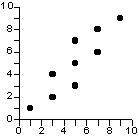
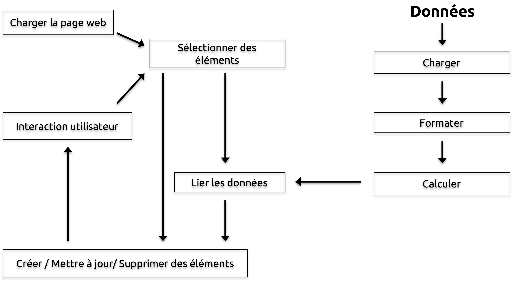

name: inverse
layout: true
class: center, middle
---

# De la donnée à l'information interactive
par Rossi Oddet
<br>
<br>
<br>


---
## Donnée ou Information ?
---
layout: false
## Voici des données
```
A	.08167
B	.01492
C	.02780
D	.04253
E	.12702
F	.02288
G	.02022
H	.06094
I	.06973
J	.00153
K	.00747
L	.04025
M	.02517
N	.06749
O	.07507
P	.01929
Q	.00098
R	.05987
S	.06333
T	.09056
U	.02758
V	.01037
W	.02465
X	.00150
Y	.01971
Z	.00074
```
---
layout: true
class: center, middle
---
## De l'information ?

### Il y a ***26 lettres*** dans l'alphabet
---
## De l'information ?

### La lettre la plus fréquente est la lettre **E**
---
> 90 % de l'information transmise au cerveau est visuelle et les images sont traitées par le cerveau 60 000 fois plus vite que le texte.
>
> -- <cite>3M Corporation & Zabisco</cite>
---
layout: false
## De l'information interactive ?

<iframe src="src/d3-tip/" width="800" height="800">
---
## Composition d'une visualisation

<iframe src="src/d3-tip-details/" width="800" height="800">
---
layout: true
class: center, middle
---
## J'ai des données, mais quel type de représentation choisir ?
### Voyons les graphes usuels en fonction de la nature des données
---
## Des données temporelles
---
layout: false
## Données Temporelles discrètes - Barres
<iframe src="src/d3-bar-time/" width="800" height="500">

---
## Données Temporelles discrètes - Empillement de barres

<iframe src="src/d3-stacked" width="800" height="500">

---
## Données Temporelles discrètes - Nuage de points

<iframe src="src/d3-simple-scatterplot" width="800" height="500">

---
## Données Temporelles continues - Courbe

<iframe src="src/d3-multiseries-line" width="800" height="500">
---
layout: true
class: center, middle
---
## Des données catégorisées
---
layout: false
## Données catégorisées - Camembert

<iframe src="src/d3-3d-donut" width="800" height="500">
---
## Données catégorisées - Anneau

<iframe src="src/d3-sequence-sunburst" width="800" height="500">
---
## Données catégorisées - Treemap

<iframe src="src/d3-treemap" width="800">

.footnote[Source : [http://bl.ocks.org/mbostock/4063582](http://bl.ocks.org/mbostock/4063582)]
---
## Données catégorisées - Empillement continue
<iframe src="src/d3-stacked-area" width="800" height="500">
---
layout: true
class: center, middle
---
## Des relations
### Corrélation vs Causalité
---
> 1/3 des accidents de la route étant dus à des conducteurs alcooliques, qu'est ce qu'on attend pour punir les 2/3 de conducteurs sobres responsables de la majorité des accidents ?
>
> -- <cite>Coluche</cite>
---
layout: false
## Relations - Nuage des points



---
## Recherche de relations - Matrice de nuages de points
<iframe src="src/d3-scatterplot-matrix"  height="700">
---
## 2+ dimensions ? - Bulles
<iframe src="src/d3-bubble-nations-v2" width="800">
---
## 2+ dimensions ? - Box plot
<iframe src="src/d3-boxplot" width="800">
---
layout: true
class: center, middle
---
## Des différences
---
layout: false
## Différences - Cartes chaudes
Comparaison des différentes techniques de construction d'application mobile

---
## Différences - Etoile
<iframe src="src/d3-spider-radar" width="800">
---
layout: true
class: center, middle
---
## Des données geographiques
---
layout: false
## Données géographiques - Des bulles sur la carte

<iframe src="src/d3-map-symbol" width="800">
---
## Données géographiques - Interaction
<iframe src="src/d3-map-airports" width="800">
---

## Données géographiques - Choroplèthe
<iframe src="src/d3-map-choropleth" width="800">
---
layout: true
class: center, middle
---
## Que fait-on de nos jours comme visualisation ?
---
## Le Data Journalisme - Recrutement au NY Times
http://www.nytimes.com/newsgraphics/2015/07/21/upshot-graphics-job-post/
---
## Le Data Journalisme - Faire participer les utilisateurs
http://www.nytimes.com/interactive/2015/05/28/upshot/you-draw-it-how-family-income-affects-childrens-college-chances.html
---
## Le Data Journalisme - Etre créatif sur la forme
http://www.nytimes.com/interactive/2014/07/08/upshot/how-the-year-you-were-born-influences-your-politics.html
---
## Le Data Journalisme - le cas ARTE
http://info.arte.tv/fr/le-monde-vu-par-arte-reportage
---
## Aide à la décision
---
## La visualisation avec D3
---
layout: false
## D3 comme « **D**ata-**D**riven **D**ocuments »

---
layout: false
## Travailler avec D3

---
layout: true
class: center, middle
---
## Gallery D3
https://github.com/mbostock/d3/wiki/Gallery
---

---
## Merci pour votre attention !
### Des Questions ?
<br>
<br>


