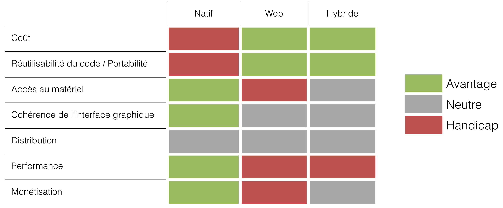

name: inverse
layout: true
class: center, middle
---
# De la donnée à l'information intéractive
par Rossi Oddet
---
## Donnée ou Information ?
---
layout: false
## Voici des données
```
Lettre Frequence
A	.08167
B	.01492
C	.02780
D	.04253
E	.12702
F	.02288
G	.02022
H	.06094
I	.06973
J	.00153
K	.00747
L	.04025
M	.02517
N	.06749
O	.07507
P	.01929
Q	.00098
R	.05987
S	.06333
T	.09056
U	.02758
V	.01037
W	.02465
X	.00150
Y	.01971
Z	.00074
```
---
layout: true
class: center, middle
---
## De l'information ?

### Il y a ***26 lettres*** dans l'alphabet
---
## De l'information ?

### La lettre la plus fréquente est la lettre **E**
---
layout: false
## De l'information intéractive ?

<iframe src="src/d3-tip/" width="800" height="800">
---
## Composition d'une visualisation

<iframe src="src/d3-tip-details/" width="800" height="800">
---
layout: true
class: center, middle
---
## J'ai des données, mais quel type de représentation choisir ?
### Voyons les graphes usuels en fonction de la nature des données
---
layout: false
## Données Temporelles discrètes - Barres
<iframe src="src/d3-bar-time/" width="800" height="500">

---
## Données Temporelles discrètes - Empillement de barres

<iframe src="src/d3-stacked" width="800" height="500">

---
## Données Temporelles discrètes - Nuage de points

<iframe src="src/d3-simple-scatterplot" width="800" height="500">

---
## Données Temporelles continues - Courbe

<iframe src="src/d3-multiseries-line" width="800" height="500">
---
## Données catégorisées - Camembert

<iframe src="src/d3-3d-donut" width="800" height="500">
---
## Données catégorisées - Anneau

<iframe src="src/d3-sequence-sunburst" width="800" height="500">
---
## Données catégorisées - Treemap
<iframe src="src/d3-treemap" width="800" height="500">
---
## Données catégorisées - Empillement continue
<iframe src="src/d3-stacked-area" width="800" height="500">
---
## Relations - Nuage des points
<iframe src="src/d3-scatterplot" width="800" height="500">
---
## Recherche de relations - Matrice de nuages de points

<iframe src="src/d3-scatterplot-matrix" width="800">
---
## 2+ dimensions ? - Bulles
<iframe src="src/d3-bubble-nations-v2" width="800">
---
## 2+ dimensions ? - Box plot
<iframe src="src/d3-boxplot" width="800">
---
## Différences - Cartes chaudes
Comparaison des différentes techniques de construction d'application mobile

---
## Différences - Etoile
<iframe src="src/d3-spider-radar" width="800">
---
## Données géographiques - Des bulles sur la carte

<iframe src="src/d3-map-symbol" width="800">
---
## Données géographiques - Intéraction

<iframe src="src/d3-map-airports" width="800">
---
## Données géographiques - Choroplèthe
<iframe src="src/d3-map-choropleth" width="800">
---
layout: true
class: center, middle
---
## Que fait-on de nos jours comme visualisation ?
---
## Pour cela, regardons les critère de recrutement d'un journaliste au NY Times
http://www.nytimes.com/newsgraphics/2015/07/21/upshot-graphics-job-post/
---
## Les intéractions ! Aller jusqu'à faire participer les utilisateurs
http://www.nytimes.com/interactive/2015/05/28/upshot/you-draw-it-how-family-income-affects-childrens-college-chances.html
---
## Etre créatif sur la forme
http://www.nytimes.com/interactive/2014/07/08/upshot/how-the-year-you-were-born-influences-your-politics.html
---
## Et pourquoi pas simplement jouer ?
http://d3tetris.herokuapp.com/
---
## Des journalistes apprennent Javascript sur le tas Chez Arte
http://info.arte.tv/fr/le-monde-vu-par-arte-reportage
---
## La visualisation avec D3
---
layout: false
## D3 ?

* D3 comme « **D**ata-**D**riven **D**ocuments »

* Conçu pour créer des visualisations des données complexes avec les standards du Web

* **Visualisation** des données != des camemberts ou des courbes
Diagramme interactif, tableaux de bords, rapports, ...

### Principe

* Utiliser les standards du Web (HTML 5, CSS, JavaScript) et éviter les technologies propriétaires (Java, Flash, SilverLight, ...)

* Permettre un niveau de personnalisation élevé
=> D3 est une librairie "bas niveau"
---
## D3 ?

---
layout: true
class: center, middle
---
## C3js, une librairie basée sur D3
http://c3js.org/
---
## NVD3, une librairie basée sur D3
http://nvd3.org/
---
layout: false
## Travailler avec D3

---
layout: true
class: center, middle
---
## Des exemples de graphiques réalisés avec D3 ?
https://github.com/mbostock/d3/wiki/Gallery
---
## Et ML Week dans tous ça ?
---
layout: false
## ML Week Edition 2016
* Nous avons ajouté au programme 3 jours de formation sur de la visualisation de données

* Vous apprenez aussi bien les techniques que les usages du domaine

* Nous nous appuyons de la librairie [D3js](http://d3js.org/)

### Au programme
* Les enjeux de la visualisation de données
* Catégorisation des données
* Premiers pas avec D3
* SVG & D3
* Canvas & D3
* Transitions avec D3
* Manipuler vos données
* Gérer les événements
* Composants D3
* Représentation géospaciale
* Techniques avancées avec D3
---
## Crédits

http://bl.ocks.org/mbostock/3885705

http://bl.ocks.org/d3noob/8952219

http://bl.ocks.org/d3noob/38744a17f9c0141bcd04

http://bl.ocks.org/mbostock/3884955

http://bl.ocks.org/mbostock/4063582

http://bost.ocks.org/mike/nations/

http://bl.ocks.org/jensgrubert/7789216

http://bl.ocks.org/nbremer/6506614
